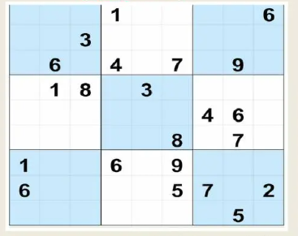

# 🧩 Sudoku Lens - Image Scanner & Interactive Solver

A modern, responsive web application that scans any Sudoku puzzle from an image (newspaper, magazine, app screenshot), extracts the 9×9 grid using computer vision & OCR, and provides a full-featured interactive solving experience.



## ✨ Features

- 📷 **Image Scanner & OCR**:
  - Drag-and-drop, browse files, or paste directly from clipboard (`Ctrl+V`).
  - Pre-processes contrast, crops 81 cells, and recognizes digits with **Tesseract.js**.
  - Side-by-side **Review & Confirm Modal** to inspect and correct any digit before solving.
  - Alternating light-blue checkerboard block styling matching newspaper puzzle formats.
- ✏️ **Manual Sudoku Creation (No Image Required)**:
  - Create custom puzzles on a blank 9×9 grid.
  - Real-time conflict validation while placing starting clues.
  - Lock clues and transition into solver with 1 click.
- 🎮 **Full Solving Controls**:
  - **Undo (`Ctrl+Z`)** & **Redo (`Ctrl+Y`)** with deep move history stack.
  - **Reset**: Revert board to initial clues with safety prompt.
  - **Validate Sudoku**: Activated when all 81 cells are filled. Verifies rows, columns, and 3×3 blocks with celebratory confetti.
  - **Persistent Solved State**: Validated puzzles remain marked as complete on refresh without asking to validate again.
- ⌨️ **Cross-Platform Input**:
  - **Laptop/Desktop**: Full keyboard controls (`1-9`, `Backspace`/`Delete`, arrow keys, `N` for notes, `Ctrl+Z`, `Ctrl+Y`).
  - **Mobile/Tablet**: Native system keyboard (`inputmode="numeric"`) or thumb-friendly on-screen keypad.
- 📝 **Pencil / Notes Mode**: Candidate digits (1–9) inside empty cells.
- 🎨 **Auto-Highlighting ("Pen & Paper" Toggle)**:
  - Turn off highlights in the top bar for an authentic, distraction-free pen-and-paper experience.
- 💾 **Continuous Auto-Save**:
  - Every move, note, and timer tick auto-saves to `localStorage`.
- ⏱️ **Completion Timer**:
  - Live tracking timer with Pause/Resume, recording exact solving time.
- 📚 **Date-Wise Archive & Library**:
  - Puzzles grouped date-wise (defaults to system time, user-editable).
  - Status filters: **All**, **Finished**, **In Progress**, **Untouched**.
  - **Export & Import Backup (JSON)** for easy cloud-free backups.

## 🚀 Quick Start

### 1. Install dependencies
```bash
npm install
```

### 2. Run locally
```bash
npm run dev
```
Open [http://localhost:3000](http://localhost:3000) in your browser.

Or on Windows, simply double-click **`run.bat`**!

### 3. Build for production
```bash
npm run build
```

## 🛠️ Tech Stack
- **React 19**
- **Vite**
- **Tailwind CSS**
- **Tesseract.js** (OCR)
- **Lucide Icons**
- **Canvas Confetti**
